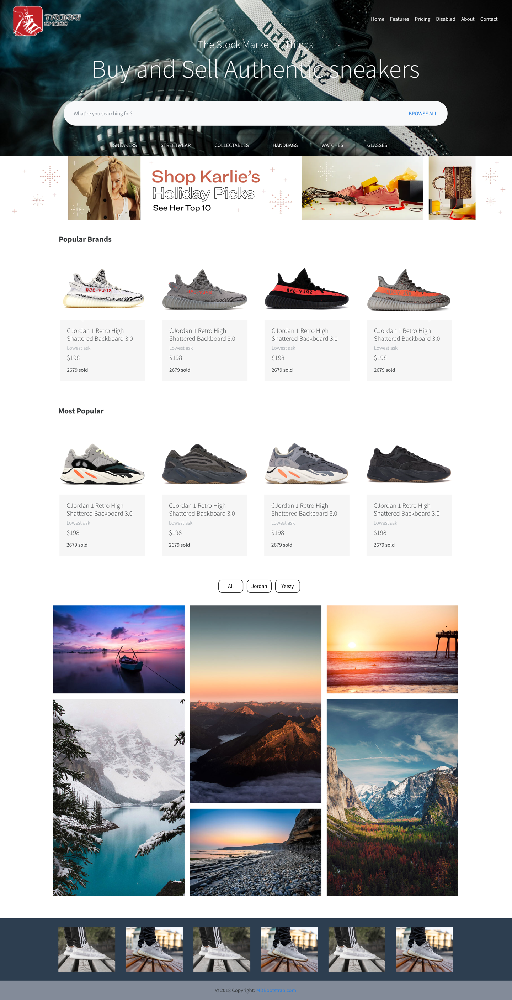

Autor: Anas Bellouzi
Date: 11/20/2019

# Prototype: [Trarri](https://anbellouzi.github.io/trarri-shoes/)

<!-- ### Instruction: visit live version @ https://anbellouzi.github.io/trarri-shoes/ -->

## User Personas:
  Freddy Cooger buys his designer shoes from Westfield mall. He usually takes the bus or Uber to Footlocker at the mall. Which Trarri, Freddy is able to buy the same quality shoes from us online and get it shipped to his house with in days. Shipping is free and warranty covers for three months for any exchange or return.

  Alfred Pennyworth bough Yeezy Boost 350 V2 black from Ebay a week ago and wanted to exchange it but was not able to. The seller on eBay had no return or exchange policy so Alfred gave the shoe away to his friend. With Trarri, you have full warranty coverage. Alfred can login in to his account on Trarri, and file a request for exchange or return. Within 24 hours, he will be emailed a shipping label with instruction on the process.

## User Journey:
  User is browsing the internet for Yeezy Boost 350 V2 White. User lands on the home page and seen the exact shoe up for sale. User clicks on the product card and is then taken to the detail page. User reads the product description, shipping and policy and decides to make purchases. User clicks on the Buy Now button which directs to the checkout page. User fills in personal information and clicks on the checkout button. User is then sent to the thank you page, with further instruction on shipping and account sign up.

## Wireframe
  

## Resources:
  - Sketch
